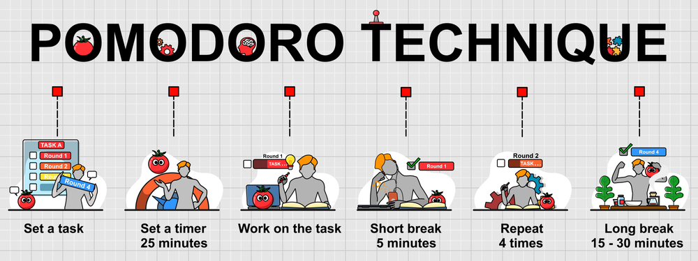

# <u>**Pomodoro Technique Project**</u>

## A project to create a timer for Pomodoro Technique.  

The Pomodoro Technique is a widely known technique for increasing 
productivity. In this project, a timer is created based on the 
Pomodoro Technique.   

    

### <u>**Libraries Used:**</u>  
Tkinter 

### <u>**Project:**</u>  
NATO Phonetic Alphabet Project 
100 Days of Code - The Complete Python Pro Bootcamp 2021  
Day 28 - Intermediate - Tkinter, Dynamic Typing and the Pomodoro GUI Application